1."在编写任何代码之前,请先描述你的方案并等待批准.如果需求不明确,在编写任何代码之前无比提出澄清问题."
2."如果一项任务需要修改超过3个文件,先停下来,将其分解成更小的任务."
3."编写代码后,列出可能出现的问题,并建议相应的测试用例来覆盖这些问题."
4."每次我纠正你后,就在CLAUDE.md文件中添加一条规则,这样就不会再发生这种情况了."
5.禁止未经同意编写测试脚本
6.完成编码工作后都需要做出总结

# AIPortrait - AI 肖像管理系统

> 基于 BuildAdmin 框架的现代化后台管理系统，采用前后端分离架构

## 变更记录 (Changelog)

### 2026-02-13 20:49:36
- 增量更新项目 AI 上下文索引文档
- 完善 `.claude/index.json` 业务模块识别
  - 新增内容管理模块识别（Agreement、Banner）
  - 更新前端小程序页面清单（13 个页面）
  - 更新后台管理 AI 模块页面清单（8 个页面）
- 更新模块统计信息
  - 总模块数：5（backend、admin-frontend、user-frontend、database、config）
  - 扫描文件数：810
  - 忽略文件数：12000+（vendor、node_modules 等）
  - 扫描覆盖率：95%
- 完善关键文件清单
  - 后端：AI 控制器、API 控制器、数据模型
  - 前端：AI 管理页面、任务详情页面
  - 小程序：13 个页面（新增 upload、agreement、banner-detail、profile/edit）
  - 数据库：最新迁移文件（20260212_create_agreement_table.php）

### 2026-02-13 00:00:00
- 更新项目 AI 上下文索引文档
- 完善 `.claude/index.json` 业务模块识别
  - 新增 AI 写真管理模块识别（Template、TemplateSub、Style、Task）
  - 新增积分系统模块识别（Score、ScoreConfig、ScoreRechargePackage）
  - 新增用户系统模块识别（User、Account、UserMoneyLog）
- 更新模块统计信息
  - 总模块数：5（backend、admin-frontend、user-frontend、database、config）
  - 扫描文件数：850+
  - 忽略文件数：12000+（vendor、node_modules 等）
- 完善关键文件清单
  - 后端：AI 控制器、API 控制器、数据模型
  - 前端：AI 管理页面、任务详情页面
  - 小程序：页面组件、服务层
  - 数据库：最新迁移文件

### 2026-02-05 15:03:04
- 更新项目 AI 上下文文档
- 完成任务详情页面优化（后台管理系统）
  - 添加 `completetime` 字段记录任务完成时间
  - 任务详情显示完成时间而非更新时间
  - 生成结果只显示成功的图片（status=1）
  - 图片展示比例改为 3:4
- 优化数据库结构
  - 新增迁移文件：`20260205150000_add_completetime_to_ai_task.php`
- 优化后端任务处理逻辑
  - `TaskProcessor.php` 在任务完成时记录 `completetime`
- 优化前端展示
  - 后台任务详情页面 `detailDialog.vue` 完成时间显示和图片过滤

### 2026-02-03 22:09:55
- 初始化 AI 上下文文档
- 完成项目架构扫描与模块识别
- 生成根级与模块级文档

---

## 项目愿景

AIPortrait 是一个基于 BuildAdmin v2.3.5 框架构建的 AI 肖像管理系统，旨在提供：
- 高效的后台管理能力
- 现代化的前端交互体验
- 可扩展的模块化架构
- 完善的权限管理体系

## 架构总览

### 技术栈

**后端 (Backend)**
- PHP 8.0.2+
- ThinkPHP 8.1.1
- MySQL (默认数据库)
- Composer 依赖管理

**管理后台 (Web)**
- Vue 3.5.13
- TypeScript 5.7.2
- Vite 6.3.5
- Element Plus 2.9.1
- Pinia 2.3.0 (状态管理)

**用户前端 (Frontend)**
- UniApp (跨平台框架)
- Vue 3
- 微信小程序 / H5 / App

**开发工具**
- ESLint + Prettier (代码规范)
- Phinx (数据库迁移)
- PNPM (包管理器)

### 架构模式

采用经典的前后端分离架构：
- **管理后台**：独立的 Vue3 SPA 应用，位于 `web/` 目录
- **用户前端**：UniApp 小程序应用，位于 `frontend/` 目录
- **后端**：ThinkPHP8 RESTful API，位于 `app/` 目录
- **数据库**：MySQL 关系型数据库，迁移文件位于 `database/migrations/`

## 模块结构图

```mermaid
graph TD
    A["(根) AIPortrait"] --> B["app - 后端应用"];
    A --> C["web - 管理后台"];
    A --> F["frontend - 用户前端"];
    A --> D["database - 数据库"];
    A --> E["config - 配置"];

    B --> B1["admin - 后台管理"];
    B --> B2["api - API 接口"];
    B --> B3["common - 公共模块"];

    B1 --> B11["ai - AI写真管理"];
    B1 --> B12["user - 用户管理"];
    B1 --> B13["auth - 权限管理"];

    B2 --> B21["Portrait - AI写真API"];
    B2 --> B22["User - 用户API"];
    B2 --> B23["Score - 积分API"];
    B2 --> B24["Agreement - 协议API"];
    B2 --> B25["Banner - Banner API"];

    C --> C1["src - 源代码"];
    C1 --> C11["views - 视图"];
    C1 --> C12["components - 组件"];
    C1 --> C13["api - API 调用"];
    C1 --> C14["stores - 状态管理"];

    F --> F1["pages - 页面"];
    F --> F2["components - 组件"];
    F --> F3["services - 服务层"];
    F --> F4["utils - 工具"];
    F --> F5["static - 静态资源"];

    D --> D1["migrations - 迁移文件"];

    click B "./app/CLAUDE.md" "查看后端模块文档"
    click C "./web/CLAUDE.md" "查看管理后台文档"
    click F "./frontend/CLAUDE.md" "查看用户前端文档"
    click D "./database/CLAUDE.md" "查看数据库模块文档"
```



## 模块索引

| 模块名称 | 路径 | 语言/框架 | 职责描述 |
|---------|------|----------|---------|
| **后端应用** | `app/` | PHP / ThinkPHP 8.1 | 提供 RESTful API、业务逻辑处理、权限控制 |
| **管理后台** | `web/` | TypeScript / Vue 3.5 | 提供管理员界面、后台管理功能、数据可视化 |
| **用户前端** | `frontend/` | UniApp / Vue 3 | 提供用户侧小程序、AI 写真生成、历史记录 |
| **数据库** | `database/` | PHP / Phinx | 数据库结构定义、版本迁移管理 |
| **配置** | `config/` | PHP | 应用配置、数据库配置、路由配置 |

## 业务模块索引

### AI 写真管理模块

**后端控制器**
- `app/admin/controller/ai/Template.php` - AI 模板管理
- `app/admin/controller/ai/TemplateSub.php` - AI 子模板管理
- `app/admin/controller/ai/Style.php` - AI 风格管理
- `app/admin/controller/ai/Task.php` - AI 任务管理

**API 接口**
- `app/api/controller/Portrait.php` - AI 写真 API（模板列表、生成任务）

**数据模型**
- `app/common/model/AiTemplate.php` - AI 模板模型
- `app/common/model/AiTemplateSub.php` - AI 子模板模型
- `app/common/model/AiStyle.php` - AI 风格模型
- `app/common/model/AiTask.php` - AI 任务模型
- `app/common/model/AiTaskResult.php` - AI 任务结果模型

**前端页面**
- `web/src/views/backend/ai/template/index.vue` - 模板管理页面
- `web/src/views/backend/ai/template/popupForm.vue` - 模板表单弹窗
- `web/src/views/backend/ai/templateSub/index.vue` - 子模板管理页面
- `web/src/views/backend/ai/templateSub/popupForm.vue` - 子模板表单弹窗
- `web/src/views/backend/ai/task/index.vue` - 任务管理页面
- `web/src/views/backend/ai/task/detailDialog.vue` - 任务详情对话框
- `web/src/views/backend/ai/style/index.vue` - 风格管理页面
- `web/src/views/backend/ai/style/popupForm.vue` - 风格表单弹窗

**小程序页面**
- `frontend/pages/index/index.vue` - 首页（模板列表）
- `frontend/pages/template-detail/index.vue` - 模板详情
- `frontend/pages/generating/index.vue` - 生成中页面
- `frontend/pages/preview/index.vue` - 预览页面
- `frontend/pages/history/index.vue` - 历史记录
- `frontend/pages/upload/index.vue` - 上传页面

### 积分系统模块

**API 接口**
- `app/api/controller/Score.php` - 积分 API（充值、消费、记录）

**数据模型**
- `app/common/model/ScoreConfig.php` - 积分配置模型
- `app/common/model/ScoreRechargePackage.php` - 充值套餐模型
- `app/common/model/ScoreRechargeOrder.php` - 充值订单模型
- `app/common/model/UserScoreLog.php` - 积分日志模型

**小程序页面**
- `frontend/pages/score/detail.vue` - 积分明细
- `frontend/pages/score/recharge.vue` - 积分充值

### 用户系统模块

**API 接口**
- `app/api/controller/User.php` - 用户 API（登录、注册、信息）
- `app/api/controller/Account.php` - 账户 API（个人资料、密码）

**数据模型**
- `app/common/model/User.php` - 用户模型
- `app/common/model/UserMoneyLog.php` - 余额日志模型

**小程序页面**
- `frontend/pages/mine/index.vue` - 我的页面
- `frontend/pages/login/index.vue` - 登录页面
- `frontend/pages/profile/edit.vue` - 个人资料编辑

### 内容管理模块

**API 接口**
- `app/api/controller/Agreement.php` - 协议 API
- `app/api/controller/Banner.php` - Banner API

**数据模型**
- `app/common/model/Agreement.php` - 协议模型
- `app/common/model/Banner.php` - Banner 模型

**小程序页面**
- `frontend/pages/agreement/index.vue` - 协议页面
- `frontend/pages/banner-detail/index.vue` - Banner 详情页面

## 运行与开发

### 环境要求

- PHP >= 8.0.2
- MySQL >= 5.7
- Node.js >= 16.0
- Composer
- PNPM

### 快速启动

**1. 后端启动**
```bash
# 安装依赖
composer install

# 配置数据库
# 编辑 .env 文件或 config/database.php

# 运行迁移
php think migrate:run

# 启动开发服务器
php think run
```

**2. 前端启动**

**管理后台 (web/)**
```bash
cd web

# 安装依赖
pnpm install

# 启动开发服务器
pnpm dev

# 构建生产版本
pnpm build
```

**用户前端 (frontend/)**
```bash
# 使用 HBuilderX 打开 frontend/ 目录

# 运行到微信小程序
# 在 HBuilderX 中选择: 运行 → 运行到小程序模拟器 → 微信开发者工具

# 运行到 H5
# 在 HBuilderX 中选择: 运行 → 运行到浏览器 → Chrome
```

### 开发模式

- **后端开发**：修改 `app/` 目录下的 PHP 文件，ThinkPHP 支持热重载
- **管理后台开发**：修改 `web/src/` 目录下的文件，Vite 提供 HMR 热更新
- **用户前端开发**：修改 `frontend/` 目录下的文件，HBuilderX 提供实时预览
- **数据库变更**：创建新的迁移文件在 `database/migrations/`

## 测试策略

### 当前状态
- 项目暂未包含自动化测试套件
- 建议后续添加单元测试和集成测试

### 建议测试方案

**后端测试**
- PHPUnit 单元测试
- API 接口测试
- 数据库迁移测试

**前端测试**
- Vitest 单元测试 (管理后台)
- Vue Test Utils 组件测试
- UniApp 自动化测试 (用户前端)
- E2E 测试 (Playwright/Cypress)

## 编码规范

### PHP 编码规范
- 遵循 PSR-12 编码标准
- 使用 PHP 8.0+ 特性（类型声明、属性提升等）
- 命名空间遵循 PSR-4 自动加载规范

### TypeScript/Vue 编码规范
- 使用 ESLint + Prettier 进行代码格式化
- 遵循 Vue 3 Composition API 风格
- TypeScript 严格模式开启
- 组件使用 `<script setup>` 语法

### 代码风格
```bash
# 前端代码检查
cd web
pnpm lint

# 前端代码格式化
pnpm format
```

## 注意事项
1. 不要随意编写临时脚本
2. 可以直接使用mysql命令行来操作数据库

## AI 使用指引

### 项目上下文理解

当使用 AI 辅助开发时，请注意：

1. **架构理解**
   - 这是一个前后端分离的项目
   - 后端使用 ThinkPHP 8 多应用模式（admin、api、common）
   - 前端使用 Vue 3 + TypeScript + Vite

2. **关键路径**
   - 后端控制器：`app/{admin|api}/controller/`
   - 前端页面：`web/src/views/`
   - API 定义：`web/src/api/`
   - 数据模型：`app/common/model/`

3. **配置文件**
   - 后端配置：`config/` 目录
   - 前端配置：`web/vite.config.ts`、`web/tsconfig.json`
   - 数据库配置：`config/database.php`

4. **常见任务**
   - 添加新接口：在 `app/admin/controller/` 或 `app/api/controller/` 创建控制器
   - 添加新页面：在 `web/src/views/` 创建 Vue 组件
   - 数据库变更：创建新的迁移文件
   - 添加路由：前端路由在 `web/src/router/`，后端路由自动注册

### 推荐的 AI 提示词模板

```
我正在开发 AIPortrait 项目（基于 BuildAdmin 框架）。

项目技术栈：
- 后端：PHP 8 + ThinkPHP 8.1
- 前端：Vue 3 + TypeScript + Vite
- 数据库：MySQL

当前任务：[描述你的任务]

相关文件：
- [列出相关文件路径]

请帮我：[具体需求]
```

## 目录结构说明

```
AIPortrait/
├── app/                    # 后端应用目录
│   ├── admin/             # 后台管理模块
│   │   └── controller/
│   │       └── ai/        # AI 写真管理
│   ├── api/               # API 接口模块
│   │   └── controller/
│   │       ├── Portrait.php   # AI 写真 API
│   │       ├── User.php       # 用户 API
│   │       ├── Score.php      # 积分 API
│   │       ├── Agreement.php  # 协议 API
│   │       └── Banner.php     # Banner API
│   └── common/            # 公共模块
│       ├── controller/    # 基础控制器
│       ├── library/       # 公共库
│       └── model/         # 数据模型
├── config/                # 配置文件
├── database/              # 数据库相关
│   └── migrations/        # 数据库迁移文件
├── frontend/              # 用户前端目录 (UniApp)
│   ├── pages/            # 小程序页面
│   │   ├── index/        # 首页
│   │   ├── template-detail/  # 模板详情
│   │   ├── generating/   # 生成中
│   │   ├── preview/      # 预览
│   │   ├── history/      # 历史记录
│   │   ├── mine/         # 我的
│   │   ├── score/        # 积分
│   │   ├── login/        # 登录
│   │   ├── upload/       # 上传
│   │   ├── agreement/    # 协议
│   │   ├── banner-detail/# Banner 详情
│   │   └── profile/      # 个人资料
│   ├── components/       # 公共组件
│   ├── services/         # 服务层
│   ├── utils/            # 工具函数
│   ├── static/           # 静态资源
│   ├── App.vue           # 应用入口
│   ├── main.js           # 入口文件
│   ├── pages.json        # 页面配置
│   └── manifest.json     # 应用配置
├── public/                # Web 入口目录
├── vendor/                # Composer 依赖
├── web/                   # 管理后台目录
│   ├── src/              # 前端源代码
│   │   ├── api/          # API 调用
│   │   ├── components/   # 公共组件
│   │   ├── stores/       # Pinia 状态管理
│   │   ├── views/        # 页面视图
│   │   │   └── backend/
│   │   │       └── ai/   # AI 管理页面
│   │   └── main.ts       # 入口文件
│   ├── node_modules/     # NPM 依赖
│   └── package.json      # 前端依赖配置
├── .claude/              # AI 上下文索引
│   └── index.json        # 项目索引文件
├── .gitignore            # Git 忽略规则
├── composer.json         # Composer 配置
└── README.md             # 项目说明

```

## 相关资源

- [BuildAdmin 官方文档](https://doc.buildadmin.com/)
- [ThinkPHP 8 文档](https://doc.thinkphp.cn/)
- [Vue 3 文档](https://cn.vuejs.org/)
- [UniApp 官方文档](https://uniapp.dcloud.net.cn/)
- [Element Plus 文档](https://element-plus.org/zh-CN/)
- [TypeScript 文档](https://www.typescriptlang.org/zh/)

## 常见问题

### 如何添加新的后台管理页面？

1. 在 `app/admin/controller/` 创建控制器
2. 在 `web/src/views/backend/` 创建 Vue 组件
3. 在 `web/src/api/backend/` 添加 API 调用方法
4. 在后台菜单管理中添加菜单项

### 如何修改数据库结构？

1. 创建新的迁移文件：`php think migrate:create YourMigrationName`
2. 编辑迁移文件定义变更
3. 运行迁移：`php think migrate:run`

### 前端如何调用后端 API？

前端 API 调用统一在 `web/src/api/` 目录下定义，使用 Axios 进行 HTTP 请求。

---

**文档生成时间**: 2026-02-13 20:49:36
**框架版本**: BuildAdmin v2.3.5
**扫描覆盖率**: 95%
**总模块数**: 5
**扫描文件数**: 810
