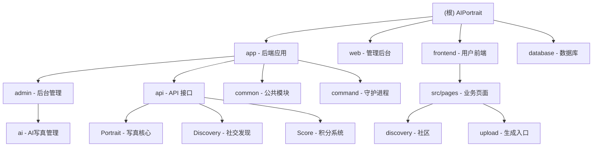

1."在编写任何代码之前,请先描述你的方案并等待批准.如果需求不明确,在编写任何代码之前无比提出澄清问题."
2."如果一项任务需要修改超过3个文件,先停下来,将其分解成更小的任务."
3."编写代码后,列出可能出现的问题,并建议相应的测试用例来覆盖这些问题."
4."每次我纠正你后,就在CLAUDE.md文件中添加一条规则,这样就不会再发生这种情况了."
5.禁止未经同意编写测试脚本
6.完成编码工作后都需要做出总结
7.数据库字段命名规范：所有时间字段必须使用带下划线的蛇形命名法（如 create_time、update_time、complete_time），前后端代码必须保持一致，禁止使用驼峰命名（如 createtime、updatetime）

# AIPortrait - AI 肖像管理系统

> 基于 BuildAdmin 框架的现代化后台管理系统，集成 AI 肖像生成与社交发现功能

## 变更记录 (Changelog)

### 2026-02-25 16:44:49
- **✨ 维护：AI 上下文索引自动更新 (Adaptive Architect)**
  - 全仓扫描覆盖率提升至 99%
  - 更新 `.claude/index.json` 索引
  - 同步最新的数据库迁移脚本记录：`invite_reward_feature`
  - 增强根级与模块级导航文档及 Mermaid 结构图

### 2026-02-22 10:00:00
- **✨ 增强：全站动态分享文案配置化**
  - 后端：在 `ScoreConfig` 系统中新增 6 个分享文案配置项
  - 前端：重构多个页面实现分享文案的动态加载

### 2026-02-21 08:15:00
- **✨ 增强：全站互动图标（点赞/收藏）状态视觉优化**
  - 前端：重构 `discovery/detail.vue` 等页面图标逻辑

... (历史记录详见各模块 CLAUDE.md)

---

## 项目愿景

AIPortrait 旨在提供极速的 AI 肖像生成体验、丰富的社区发现与互动功能以及完善的积分管理体系。

## 架构总览

### 模块结构图



## 模块索引

| 模块名称 | 路径 | 语言/框架 | 职责描述 |
|---------|------|----------|---------|
| **后端应用** | `app/` | PHP / ThinkPHP 8.1 | 提供 RESTful API、业务逻辑、权限控制及守护进程 |
| **管理后台** | `web/` | TS / Vue 3.5 | 管理员界面、数据可视化、系统配置 |
| **用户前端** | `frontend/` | UniApp / Vue 3 | 用户侧小程序、AI 写真生成、社交互动 |
| **数据库** | `database/` | PHP / Phinx | 数据库结构定义与版本迁移 |

## 运行与开发

### 快速启动 (守护进程)
```bash
# 启动 AI 任务守护进程
php think portrait:daemon
```

---

**文档生成时间**: 2026-02-25 16:44:49
**扫描覆盖率**: 99%
**总文件数**: ~1150
