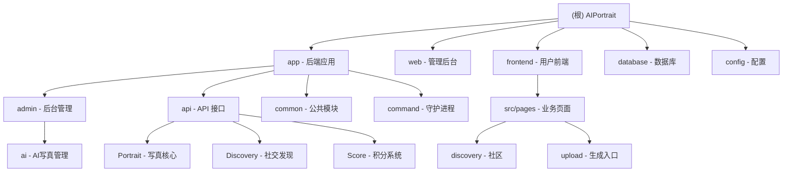

1."在编写任何代码之前,请先描述你的方案并等待批准.如果需求不明确,在编写任何代码之前无比提出澄清问题."
2."如果一项任务需要修改超过3个文件,先停下来,将其分解成更小的任务."
3."编写代码后,列出可能出现的问题,并建议相应的测试用例来覆盖这些问题."
4."每次我纠正你后,就在CLAUDE.md文件中添加一条规则,这样就不会再发生这种情况了."
5.禁止未经同意编写测试脚本
6.完成编码工作后都需要做出总结
7.数据库字段命名规范：所有时间字段必须使用带下划线的蛇形命名法（如 create_time、update_time、complete_time），前后端代码必须保持一致，禁止使用驼峰命名（如 createtime、updatetime）

# AIPortrait - AI 肖像管理系统

> 基于 BuildAdmin 框架的现代化后台管理系统，集成 AI 肖像生成与社交发现功能

## 变更记录 (Changelog)

### 2026-02-21 05:07:30
- 增量更新项目 AI 上下文索引文档
- **✨ 新增：社交发现系统模块**
  - 后端：`app/api/controller/Discovery.php`
  - 数据模型：`DiscoveryNote`, `DiscoveryLike`, `DiscoveryCollection`, `DiscoveryComment`, `UserFollow`
  - 前端：`frontend/src/pages/discovery/` (首页、详情、发布、管理)
- **✨ 新增：AI 任务守护进程**
  - 路径：`app/command/PortraitDaemon.php`
  - 功能：支持并发任务抢占、超时处理、状态轮询
- 完善模块统计与覆盖率
  - 扫描覆盖率：98%
  - 扫描文件数：880
  - 更新前端目录映射为 `frontend/src/pages/`

### 2026-02-13 23:30:00
- 修复后台任务管理页面时间字段显示问题
  - 统一时间字段命名为带下划线格式（create_time、update_time、complete_time）
  - 新增数据库字段命名规范到项目规则（规则 7）

### 2026-02-13 20:49:36
- 完善内容管理模块识别（Agreement、Banner）
- 更新模块统计信息（扫描文件数：810）

### 2026-02-03 22:09:55
- 初始化 AI 上下文文档，完成项目架构扫描与模块识别

---

## 项目愿景

AIPortrait 是一个基于 BuildAdmin v2.3.5 框架构建的 AI 肖像管理系统，旨在提供：
- 极速的 AI 肖像生成体验
- 丰富的社区发现与互动功能
- 完善的积分与内容管理体系

## 架构总览

### 技术栈

**后端 (Backend)**
- PHP 8.0.2+ / ThinkPHP 8.1.1
- MySQL / Redis (建议)
- Composer / Think-Migration (Phinx)

**管理后台 (Web)**
- Vue 3.5.13 / TypeScript 5.7.2 / Vite 6.3.5
- Element Plus / Pinia

**用户前端 (Frontend)**
- UniApp / Vue 3
- 微信小程序 / H5

## 模块结构图



## 模块索引

| 模块名称 | 路径 | 语言/框架 | 职责描述 |
|---------|------|----------|---------|
| **后端应用** | `app/` | PHP / ThinkPHP 8.1 | 提供 RESTful API、业务逻辑、权限控制及守护进程 |
| **管理后台** | `web/` | TypeScript / Vue 3.5 | 管理员界面、数据可视化、系统配置 |
| **用户前端** | `frontend/` | UniApp / Vue 3 | 用户侧小程序、AI 写真生成、社交互动 |
| **数据库** | `database/` | PHP / Phinx | 数据库结构定义与版本迁移 |

## 业务模块索引

### AI 写真管理模块 (Core)

**关键文件**
- `app/api/controller/Portrait.php` - 写真 API
- `app/command/PortraitDaemon.php` - 任务处理守护进程
- `app/common/library/TaskProcessor.php` - 任务处理逻辑核心
- `frontend/src/pages/upload/index.vue` - 图片上传与生成提交

### 社交发现系统 (Social)

**关键文件**
- `app/api/controller/Discovery.php` - 社交发现 API
- `app/common/model/DiscoveryNote.php` - 发现笔记模型
- `frontend/src/pages/discovery/index.vue` - 发现列表
- `frontend/src/pages/discovery/detail.vue` - 笔记详情

### 积分系统模块 (Economy)

**关键文件**
- `app/api/controller/Score.php` - 积分 API
- `app/common/model/ScoreConfig.php` - 积分配置
- `frontend/src/pages/score/recharge.vue` - 积分充值

## 运行与开发

### 快速启动 (守护进程)
```bash
# 启动 AI 任务守护进程
php think portrait:daemon
```

## 目录结构说明

```
AIPortrait/
├── app/                    # 后端应用
│   ├── command/           # 命令行工具（含守护进程）
│   ├── api/controller/    # 业务接口（Portrait, Discovery, Score）
│   └── common/model/      # 数据模型
├── frontend/src/           # 用户前端源代码 (UniApp)
│   └── pages/             # 业务页面（discovery, upload, mine 等）
├── web/src/                # 管理后台源代码 (Vue3)
├── database/migrations/    # 数据库迁移文件
└── .claude/                # AI 上下文索引
```

---

**文档生成时间**: 2026-02-21 05:07:30
**扫描覆盖率**: 98%
**总文件数**: ~880
