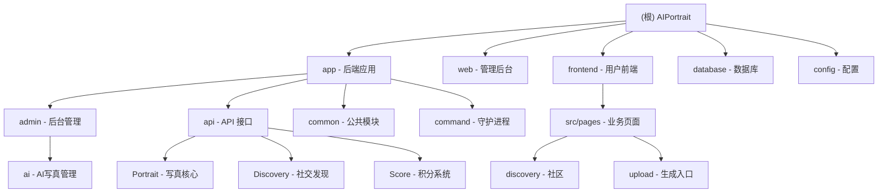

1."在编写任何代码之前,请先描述你的方案并等待批准.如果需求不明确,在编写任何代码之前无比提出澄清问题."
2."如果一项任务需要修改超过3个文件,先停下来,将其分解成更小的任务."
3."编写代码后,列出可能出现的问题,并建议相应的测试用例来覆盖这些问题."
4."每次我纠正你后,就在CLAUDE.md文件中添加一条规则,这样就不会再发生这种情况了."
5.禁止未经同意编写测试脚本
6.完成编码工作后都需要做出总结
7.数据库字段命名规范：所有时间字段必须使用带下划线的蛇形命名法（如 create_time、update_time、complete_time），前后端代码必须保持一致，禁止使用驼峰命名（如 createtime、updatetime）

# AIPortrait - AI 肖像管理系统

> 基于 BuildAdmin 框架的现代化后台管理系统，集成 AI 肖像生成与社交发现功能

## 变更记录 (Changelog)

### 2026-02-21 08:15:00
- **✨ 增强：全站互动图标（点赞/收藏）状态视觉优化**
  - 前端：重构 `discovery/detail.vue` 和 `discovery/index.vue` 中的点赞与收藏图标
  - 视觉：引入空心/实心切换逻辑（♡/❤, ☆/★），并为收藏图标配置专属金色（#ffb800）
  - 后端：优化 `Discovery.php` 的 `index` 和 `myNotes` 接口，支持批量查询并返回当前用户的互动状态（`is_like`, `is_collection`）

### 2026-02-21 08:00:00
- **🔧 修复：头像 URL 域名重复拼接问题**
  - 后端：优化 `User.php` 和 `Discovery.php` 的 `convertImageUrl` 逻辑，增加域名检测，防止对已包含域名的路径重复拼接
  - 前端：重构全站 `formattedAvatar` 逻辑，增加基于 `API_CONFIG.baseURL` 的 Host 智能匹配，确保 URL 拼接的唯一性与准确性

### 2026-02-21 07:45:00
- **✨ 增强：全站头像路径转换逻辑加固**
  - 后端：在 `Discovery.php` 中引入 `convertImageUrl` 方法，统一处理发现列表、详情、评论及我的笔记中的头像路径，确保返回带域名的绝对地址
  - 前端：在“发现列表”、“发现详情”、“关注/粉丝列表”等多个页面引入 `formattedAvatar` 工具逻辑，实现前端侧的路径二次保障，彻底解决发布后头像无法显示的问题

### 2026-02-21 07:30:00
- **🔧 修复：发布后小程序头像无法显示问题**
  - 后端：在 `User.php` 的 `info`, `checkIn`, `mobileLogin`, `wechatLogin` 接口中统一使用 `convertImageUrl` 转换头像路径为绝对 URL
  - 前端：在 `mine/index.vue` 中新增 `formattedAvatar` 计算属性，多重保障处理相对路径
  - 优化：`mine/index.vue` 获取统计数据时同步更新并缓存最新的用户信息

### 2026-02-21 07:20:00
- **🔧 修复：退出登录重复确认弹窗 Bug**
  - 前端：移除 `mine/index.vue` 中多余的 `uni.showModal` 调用，统一使用 `utils/auth.js` 内部封装的确认逻辑，避免双重确认弹窗

### 2026-02-21 07:15:00
- **✨ 优化：'我的'页面积分卡片交互重构**
  - 前端：将整个 `score-card` 区域的点击事件统一指向 `goRecharge`，实现全域充值跳转
  - 理由：由于下方菜单列表已提供"积分明细"入口，卡片区域应聚焦核心充值功能，提升转化链路

### 2026-02-21 07:10:00
- **🔧 修复：“我的”页面充值按钮点击失效问题**
  - 前端：修复 `mine/index.vue` 中 `score-card` 的伪元素遮挡导致无法触发充值跳转的问题
  - 优化：给 `.score-card::before` 装饰元素添加 `pointer-events: none`，提升 `.score-btn` 的 `z-index` 层级

### 2026-02-21 06:15:00
- **✨ 增强：登录自动同步微信资料**
  - 后端：`User.php` 的 `wechatLogin` 接口支持接收并自动保存微信昵称和头像
  - 前端：登录页面集成 `uni.getUserProfile`，实现首次登录资料自动填充
- **🔧 修复：会员资料保存报错与头像路径优化**
  - 后端：修改 `Account` 验证器，从 `edit` 场景移除 `username` 必填限制，适配微信自动注册用户
  - 后端：优化 `Account.php` 头像保存逻辑，自动剥离域名仅保留相对路径，解决 `localhost` 存库问题
  - 后端：放宽昵称校验规则，移除 `chsDash` 限制，支持更多样化的微信昵称
- **🎨 视觉优化：空状态图标全局更新**
  - 采用 SVG Mask 方案替换所有页面的 Emoji 占位符
  - 涉及页面：发现列表、我的相册、作品集、点赞/收藏列表、粉丝/关注列表、首页模板列表
- **🔧 修复：积分明细标题截断问题**
  - 后端：`TaskProcessor.php` 强化日志描述信息
  - API：`Score.php` 优化日志合并算法与 `cleanMemo` 清理逻辑
- **✨ 增强：'我的'页面极致极简风重构**
  - 适配 native 导航栏，采用黑白 Geek 审美，全面使用自定义 SVG 图标


### 2026-02-13 23:30:00
- 修复后台任务管理页面时间字段显示问题
  - 统一时间字段命名为带下划线格式（create_time、update_time、complete_time）
  - 新增数据库字段命名规范到项目规则（规则 7）

### 2026-02-13 20:49:36
- 完善内容管理模块识别（Agreement、Banner）
- 更新模块统计信息（扫描文件数：810）

### 2026-02-03 22:09:55
- 初始化 AI 上下文文档，完成项目架构扫描与模块识别

---

## 项目愿景

AIPortrait 是一个基于 BuildAdmin v2.3.5 框架构建的 AI 肖像管理系统，旨在提供：
- 极速的 AI 肖像生成体验
- 丰富的社区发现与互动功能
- 完善的积分与内容管理体系

## 架构总览

### 技术栈

**后端 (Backend)**
- PHP 8.0.2+ / ThinkPHP 8.1.1
- MySQL / Redis (建议)
- Composer / Think-Migration (Phinx)

**管理后台 (Web)**
- Vue 3.5.13 / TypeScript 5.7.2 / Vite 6.3.5
- Element Plus / Pinia

**用户前端 (Frontend)**
- UniApp / Vue 3
- 微信小程序 / H5

## 模块结构图



## 模块索引

| 模块名称 | 路径 | 语言/框架 | 职责描述 |
|---------|------|----------|---------|
| **后端应用** | `app/` | PHP / ThinkPHP 8.1 | 提供 RESTful API、业务逻辑、权限控制及守护进程 |
| **管理后台** | `web/` | TypeScript / Vue 3.5 | 管理员界面、数据可视化、系统配置 |
| **用户前端** | `frontend/` | UniApp / Vue 3 | 用户侧小程序、AI 写真生成、社交互动 |
| **数据库** | `database/` | PHP / Phinx | 数据库结构定义与版本迁移 |

## 业务模块索引

### AI 写真管理模块 (Core)

**关键文件**
- `app/api/controller/Portrait.php` - 写真 API
- `app/command/PortraitDaemon.php` - 任务处理守护进程
- `app/common/library/TaskProcessor.php` - 任务处理逻辑核心
- `frontend/src/pages/upload/index.vue` - 图片上传与生成提交

### 社交发现系统 (Social)

**关键文件**
- `app/api/controller/Discovery.php` - 社交发现 API
- `app/common/model/DiscoveryNote.php` - 发现笔记模型
- `frontend/src/pages/discovery/index.vue` - 发现列表
- `frontend/src/pages/discovery/detail.vue` - 笔记详情

### 积分系统模块 (Economy)

**关键文件**
- `app/api/controller/Score.php` - 积分 API
- `app/common/model/ScoreConfig.php` - 积分配置
- `frontend/src/pages/score/recharge.vue` - 积分充值

## 运行与开发

### 快速启动 (守护进程)
```bash
# 启动 AI 任务守护进程
php think portrait:daemon
```

## 目录结构说明

```
AIPortrait/
├── app/                    # 后端应用
│   ├── command/           # 命令行工具（含守护进程）
│   ├── api/controller/    # 业务接口（Portrait, Discovery, Score）
│   └── common/model/      # 数据模型
├── frontend/src/           # 用户前端源代码 (UniApp)
│   └── pages/             # 业务页面（discovery, upload, mine 等）
├── web/src/                # 管理后台源代码 (Vue3)
├── database/migrations/    # 数据库迁移文件
└── .claude/                # AI 上下文索引
```

---

**文档生成时间**: 2026-02-21 05:07:30
**扫描覆盖率**: 98%
**总文件数**: ~880
